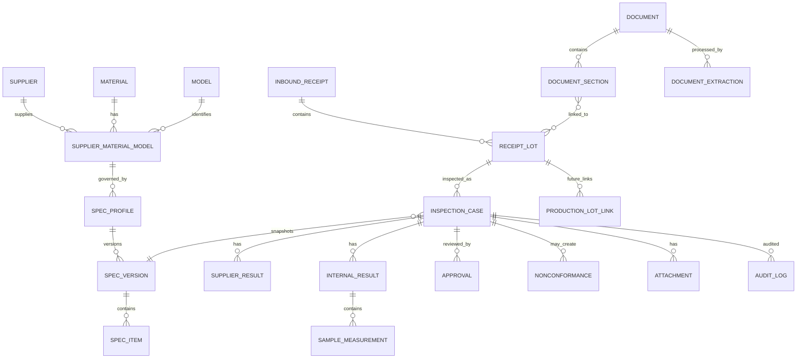
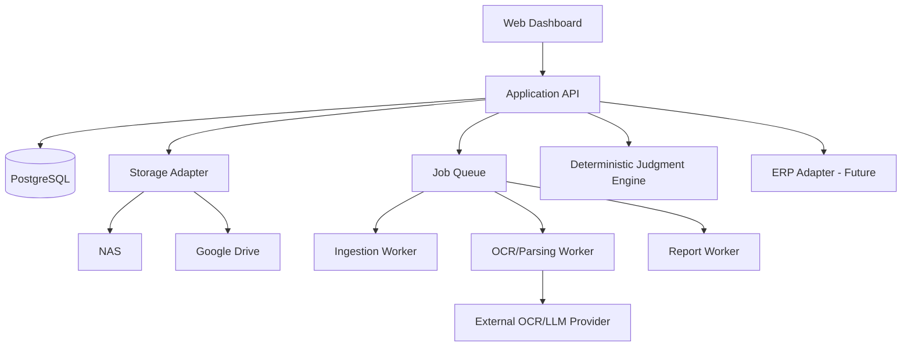

PRD: 한양화학 수입검사 디지털화 및 LOT 추적 시스템

> **문서명:** `prd.md`   
> **버전:** 0.9   
> **상태:** 개발 착수 가능 초안 - 미확정 항목은 설정값 또는 확장 지점으로 격리   
> **작성 기준일:** 2026-07-30   
> **대상 조직:** 한양화학 품질팀   
> **제품 범위:** 한양화학에 입고되는 모든 원자재/부자재   
> **문서 목적:** 다른 AI 개발 에이전트 또는 개발팀이 본 문서만으로 시스템 구조, 업무 흐름, 데이터 모델, 화면, 판정 규칙, 테스트와 인수 조건을 일관되게 구현하도록 한다.

> **구현 증거 상태 (2026-08-01):** P0A/P0B/P1/P2에 이어 synthetic P3 source candidate도 Hermes controller 독립 QA를 통과해 source accepted다. 이는 이 PRD의 제품·운영 승인이나 전체 MVP 완료를 뜻하지 않는다. 문서 작성 시점 P3는 base `b7bc4a8ca258d1d44d240f8884a4b4ec8cbb6abf` 위의 uncommitted/unintegrated/unpushed exact candidate이며, P4/P5는 시작하지 않았다. 실데이터 apply/import, 외부 OCR/AI, production migration·DB-role activation, 배포·release·public service는 계속 미승인이다.

  

0. 개발 에이전트가 반드시 지켜야 할 해석 원칙

1. 이 시스템의 정본(System of Record) 은 데이터베이스에 저장된 승인 완료 데이터와 원본 문서이다.

2. 공급사 COA에 기재된 Specification은 참고 데이터이며, 최종 적합 여부는 검사 당시 유효한 한양화학 수입검사 기준 버전으로 판단한다.

3. OCR/생성형 AI의 출력은 추출 후보일 뿐이다. OCR 결과만으로 검사 건을 자동 확정하거나 최종 승인해서는 안 된다.

4. 한양화학 자체 측정값이 존재하는 동일 검사항목은 자체 측정값을 최종 판정에 우선 사용하고, 공급사 측정값은 비교·참고 데이터로 보존한다.

5. 원본 PDF/이미지는 수정하거나 덮어쓰지 않는다. 전처리 이미지, OCR 결과, 사람의 수정값은 별도 버전으로 관리한다.

6. 공급사별 문서 레이아웃, 검사항목 수, 샘플 수를 하드코딩하지 않는다.

7. 품목 코드, 공급업체 코드, BOM, LOT-입고 관계가 추후 확정되더라도 데이터 마이그레이션 없이 마스터 데이터만 보완할 수 있어야 한다.

8. 모든 수동 수정, 문서 재매칭, 판정 변경, 승인, 특채, 재검사는 감사로그에 남긴다.

9. 수치 판정은 부동소수점이 아닌 Decimal 기반으로 처리한다.

10. 외부 OCR/LLM 공급자, NAS, Google Drive, ERP는 모두 교체 가능한 Adapter 인터페이스로 구현한다.

  

11. 제품 개요

한양화학은 제습용품을 OEM 방식으로 제작·납품하며 대표 제품은 물먹는하마이다. 제품을 구성하는 주요 자재는 용기, 제습제, 스티커, 뚜껑, 포장상자 등이며 실제 품목과 세부 BOM은 다양하다.

현재 품질팀은 원자재 입고 시 공급업체가 종이로 제공하는 제품검사성적서 또는 Certificate of Analysis(COA)를 확인하고, 주요 정보를 수입검사성적서에 수기로 입력한다. 공급사가 측정한 검사항목과 값이 한양화학 수입검사 기준에 적합한지 사람이 비교·판정하며, 일부 화학소재는 한양화학 시험실에서 별도 시험 후 공급사 COA와 수기 또는 종이 문서로 매칭한다.

신규 시스템은 스캔 PDF 수집, OCR/문서 파싱, 입고 정보 등록, 한양화학 기준에 의한 자동 판정, 자체 검사 입력, 품질팀장 검토·확정, 원본 문서 보관, LOT 조회 및 보고서 출력을 하나의 흐름으로 통합한다.

  

2. 문제 정의

2.1 현재 문제

● 종이 COA와 제품검사성적서를 사람이 분류·보관한다.

● 공급사 문서의 품명, 모델, LOT, 생산일, 시험항목과 측정값을 수기로 재입력한다.

● 공급사 Specification과 한양화학 기준을 사람이 눈으로 대조한다.

● 품목별·공급사별·모델별로 검사 기준과 항목이 달라 판단 누락 위험이 있다.

● 화학소재의 공급사 COA와 한양화학 자체 시험 결과가 분리되어 누락되거나 다른 LOT와 섞이는 문제가 발생한다.

● 사후 품질 이슈 발생 시 원자재 입고 및 검사 이력을 찾는 데 시간이 오래 걸린다.

● 기존 Raw Data Excel은 가로 방향으로 검사항목과 결과 열이 반복되어 항목 수와 샘플 수가 가변적인 실제 업무를 안정적으로 표현하기 어렵다.

● 문서 재스캔, 잘못된 LOT 연결, 기준 변경 후 재판정 등에 대한 변경 이력이 체계적으로 남지 않는다.

2.2 핵심 리스크

● 부적합 원자재의 오판정 또는 사용

● COA 필수 항목 누락 미인지

● 공급사 규격을 한양화학 규격으로 오인

● 서로 다른 LOT의 COA와 자체 검사 결과 혼합

● 고객 품질 이슈 시 원인 원자재 LOT 특정 실패

● 사람의 수기 전사 오류 및 문서 분실

● 기준 개정 후 과거 검사 건의 기준이 임의로 변경되는 문제

  

3. 목표와 성공 조건

3.1 비즈니스 목표

1. 모든 입고 원자재/부자재의 문서와 검사 결과를 디지털로 통합한다.

2. 공급사 COA의 주요 필드와 시험 결과를 자동 추출한다.

3. 공급사 측정값을 한양화학 기준으로 자동 판정한다.

4. 한양화학 자체 검사 결과를 동일 입고 LOT에 정확히 연결한다.

5. 검사자 입력 후 품질팀장이 검토·확정하는 전자 승인 흐름을 제공한다.

6. 원자재 LOT의 입고·검사 이력을 즉시 조회한다.

7. 향후 ERP 연계를 통해 원자재 LOT에서 해당 자재가 투입된 생산/완제품 LOT까지 추적한다.

8. 품목 코드, 공급업체 코드, BOM, 검사 기준 변경을 마스터 데이터로 관리한다.

3.2 제품 성공 조건

● 원본 문서, 추출값, 수정값, 최종값의 관계를 추적할 수 있다.

● 필수값 누락 또는 OCR 불확실성이 조용히 무시되지 않고 검토 대상으로 표시된다.

● 공급사 기준과 한양화학 기준이 화면과 데이터 모델에서 명확히 분리된다.

● 자체 검사가 필요한 품목은 자체 검사 완료 전 최종 적합 확정이 불가능하다.

● 품질팀장 승인 전 데이터는 확정 상태가 되지 않는다.

● 검사 당시 적용된 기준 버전이 영구 고정된다.

● 동일 파일의 중복 등록과 동일 문서의 다른 입고 건 오매칭을 탐지한다.

● 기존 Raw Data Excel 형식, 통합 검사보고서, LOT 추적 보고서, 월별·공급사별 품질 통계 Excel을 출력할 수 있다.

● ERP가 없어도 MVP가 동작하며, 향후 ERP 연결 시 핵심 테이블 재설계가 필요하지 않다.

3.3 정량 KPI

초기 운영 데이터를 확보한 후 기준선을 측정한다. 아래 값은 파일럿 인수 목표이며 관리자 설정으로 조정 가능해야 한다.

|KPI                           |파일럿 목표|  
|------------------------------|-----:|  
|지원 템플릿의 필수 헤더 필드 추출 정확도       |95% 이상|  
|지원 템플릿의 숫자 측정값 정확도            |98% 이상|  
|승인 완료 검사 건의 원본 문서 연결률         |100%  |  
|승인 완료 검사 건의 기준 버전 연결률         |100%  |  
|감사로그 누락 허용                    |0건    |  
|동일 파일 중복 등록 차단률               |100%  |  
|OCR 실패 또는 저신뢰 필드의 사용자 검토 큐 노출률|100%  |

정확도는 자동 확정률과 구분한다. 정확도가 낮은 문서는 사람이 확인하도록 보내며, 시스템이 임의로 값을 생성해 통과시키지 않는다.

  

4. 범위

4.1 MVP 포함 범위

대상 자재

첨부 검사기준 Excel의 분류를 사용한다.

● 원료

● 첨가제

● 케이스

● 포장물

현재 첨부 기준서에는 원료 3개, 케이스 4개, 포장물 31개 템플릿이 있으며 첨가제 템플릿은 확인되지 않았다. 신규 첨가제와 기타 자재도 동일한 공통 구조로 등록 가능해야 한다.

기능

● 품목·공급업체·모델 조합별 검사기준 마스터

● 품목/공급업체 코드 필드와 추후 일괄 업데이트 기능

● 입고 건 및 LOT 수기 등록

● 스캔 PDF의 NAS 폴더 자동 수집

● Google Drive 특정 폴더 수집

● 대시보드 수동 업로드

● PDF 원본 보관과 해시 기반 중복 탐지

● 문서 분류, OCR, 표 파싱, 구조화 데이터 추출

● OCR 저신뢰 필드의 사람 검토

● 입고 건과 문서의 후보 매칭 및 사용자 교차검증

● 공급사 검사항목, 공급사 기준, 공급사 결과값 저장

● 공급사 항목명과 한양화학 표준 항목명 매핑

● 단위 자동 환산

● 한양화학 기준 자동 판정

● 자체 검사 대상 항목의 수기 입력

● 가변 샘플 수와 항목별 계산/판정 정책

● 검사자 제출 → 품질팀장 검토·확정

● 적합, 부적합, 판정 보류, 재검사, 특채 상태 관리

● 부적합 처리방안과 후속조치

● 사진, PDF, 시험 기록 등 증빙 첨부

● 기존 Raw Data Excel 호환 출력

● 공급사 COA + 자체검사 통합 검사보고서

● LOT 추적 보고서

● 월별·공급사별 품질 통계 Excel

● 사용자/권한, 감사로그, 기준 버전 관리

● 관리자 설정과 Feature Flag

4.2 MVP 제외 범위

● ERP/MES/WMS 실시간 연동

● AQL 표에 따른 Sample Size, Ac/Re 자동 계산

● 검사 장비 직접 연동

● 손글씨를 필수 업무 필드로 자동 인식

● 자동 이메일/메신저 통보

● 완제품 생산 LOT와 출하 LOT의 자동 연결

● 고객 클레임/CAPA 전체 프로세스

● 공급사 포털

● 전자서명법상 공인전자서명

4.3 후속 범위

● ERP의 원자재 코드, 입고 전표, 발주번호 동기화

● ERP/MES의 원자재 투입 실적을 통한 생산 LOT 자동 연결

● 완제품 LOT, 출하 LOT, 납품처 추적

● 검사장비 CSV/Excel/API Import

● 공급사 부적합 통보와 개선대책서 관리

● 알림 및 SLA 관리

● BOM 기반 영향 범위 분석

● 고객 품질 이슈에서 원인 후보 원자재 LOT 역추적

● 공급사별 품질 등급과 Scorecard

  

5. 근거 자료와 관찰 사항

5.1 첨부 자료

1. inbound-inspection-raw-data

2. qm301-7-rb-import-inspection

3. calcium-chloride-coa-2025-04-23

4. domestic-8p-package

5.2 Raw Data 구조

Raw Data의 공통 필드는 다음과 같다.

● Model명

● 품명

● Lot Size

● 검사구분

● 입고일자

● 검사일자

● 검사자

● 불량수량

● 불량률

● 제조업체

● Sample Size

● 판정

● 처리방안

● 검사항목, 기준, 결과, 판정 반복

데이터베이스는 이 가로형 구조를 그대로 사용하지 않고 검사 건, 검사항목, 샘플 측정값을 정규화한다. Raw Data 형식은 출력 호환 포맷으로만 사용한다.

5.3 수입검사 기준서 구조

qm301-7-rb-import-inspection에는 38개 품목/공급업체 템플릿이 있다.

● 원료: 3

● 케이스: 4

● 포장물: 31

● 첨가제: 첨부 파일에서 확인되지 않음

● 전체 검사항목 행: 119개

공통 양식에는 검사구분, Model명, 품명, 제조업체, 입고일자, Lot Size, Sample Size, 검사자, AQL, 처리방안, 검사항목, 기준, 결과, 판정, 부적합 현황, 특기사항과 결재란이 있다. 문서번호는 HYC-QC-02-002이다.

5.4 문서 유형에서 확인된 데이터 다양성

염화칼슘 공급사 COA

● 이미지 기반 스캔 PDF

● 영문 표

● ITEM / SPECIFICATION / RESULT 구조

● LOT 번호 존재

● 도장과 값이 겹치는 영역 존재

● 손글씨 메모 존재

● 공급사 규격과 한양화학 규격이 다를 수 있음

● 한양화학의 필수 항목이 공급사 COA에 없을 수 있음

물먹는하마 내수 8P 패키지 검사성적서

● 한국어 이미지 기반 스캔 PDF

● 거래선, 품명, 검사일자, LOT NO., LOT 크기

● 규격 항목별 5개 측정값

● 재질 항목별 3개 정성값

● 외관 검사 결과 문장

● 항목별 판정과 최종 판정

● AQL 관련 문구 존재

따라서 하나의 항목에 하나의 결과값만 저장하는 모델을 금지한다.

  

6. 사용자와 권한

|역할                     |주요 권한                                                                     |  
|-----------------------|--------------------------------------------------------------------------|  
|검사자(Quality Inspector) |입고 건 작성, 문서 업로드/매칭, OCR 검토·수정, 자체검사 입력, 임시저장, 검토 요청, 재검사 입력               |  
|품질팀장(Quality Lead)     |검사 건 검토, 반려, 최종 확정, 부적합/특채 승인, 기준 버전 승인, 문서 재매칭 승인                        |  
|시스템 관리자(Admin)         |사용자, 권한, 품목, 공급업체, 모델, 기준, 단위, OCR Provider, 저장소, Feature Flag, 코드 일괄 업데이트|  
|조회 사용자(Viewer/Auditor) |승인 완료 검사 건, 원본 문서, 보고서, 감사로그 조회 및 허용된 출력                                  |  
|연계 서비스(Service Account)|NAS/Drive 수집, OCR 호출, ERP 동기화 등 최소 권한 API 접근                              |

권한 원칙

● 검사자는 자신이 작성한 건을 제출 후 임의 확정할 수 없다.

● 품질팀장은 승인 또는 반려할 수 있다.

● 승인 완료 건의 수정은 정정본을 생성하고 원본 버전은 유지한다.

● 기준 버전은 사용 중인 검사 건이 존재하면 물리 삭제할 수 없다.

● 시스템 관리자는 업무 판정을 대신 승인할 수 없도록 권한을 분리한다. 단, 비상 권한은 감사로그와 사유 입력을 강제한다.

  

7. 핵심 용어

|용어                         |정의                                  |  
|---------------------------|------------------------------------|  
|입고 건(Inbound Receipt)      |특정 일자에 한양화학으로 입고된 거래 단위             |  
|입고 LOT(Receipt Lot)        |입고 건에 포함된 원자재 LOT 단위                |  
|검사 건(Inspection Case)      |특정 입고 LOT에 적용되는 수입검사 업무 단위          |  
|공급사 문서(Supplier Document)  |COA, 제품검사성적서 등 공급사가 제공한 원본          |  
|공급사 결과(Supplier Result)    |공급사가 측정·기재한 항목, 규격, 값, 판정           |  
|자체 검사(Internal Inspection) |한양화학 시험실 또는 품질팀이 직접 수행한 검사          |  
|기준 프로파일(Spec Profile)      |품목 + 공급업체 + 모델 조합의 검사 기준 묶음         |  
|기준 버전(Spec Version)        |적용 시작/종료일이 있는 불변 검사 기준 버전           |  
|표준 검사항목(Standard Test Item)|공급사별 별칭을 통합하는 한양화학 내부 항목            |  
|특채(Special Acceptance)     |규격 미충족 또는 서류 예외를 승인권자가 조건부 사용 승인한 상태|  
|판정 보류(On Hold)             |필수 서류/결과/검토가 부족하여 최종 판단할 수 없는 상태    |

  

8. 확정된 제품 정책

9. 구축 대상은 모든 원자재/부자재이다.

10. 검사 기준 키는 품목 + 공급업체 + 모델 + 기준 버전이다.

11. 품목/공급업체 코드가 없거나 미확정이어도 내부 UUID로 운영하고 추후 외부 코드를 일괄 업데이트한다.

12. 품목 분류는 현재 Excel의 원료/첨가제/케이스/포장물을 우선 사용한다.

13. BOM은 추후 확보 후 세부 구성과 관계를 업데이트한다.

14. 입고 정보는 품질팀이 대시보드에서 직접 입력하고, OCR/문서 정보와 교차검증 후 확정한다.

15. LOT와 입고 건의 정확한 관계가 미확정이므로 다대다까지 수용하는 데이터 모델을 사용한다.

16. 자동 매칭 우선순위는 LOT No. → 품목 코드 → 공급업체 → 품명/모델 → 생산일 → 입고일 → 입고수량이다.

17. 손글씨 OCR은 필수가 아니며 참고 메모로 저장한다. 핵심 필드는 수동 입력 가능해야 한다.

18. COA 필수 항목 누락 시 품목별 설정에 따라 공급사 보완 / 한양화학 자체검사 대체 / 특채를 선택한다.

19. 동일 항목의 자체 검사값이 있으면 자체 검사값을 최종 판정에 우선 사용하고 공급사 값은 참고한다.

20. 전체 판정 기본 규칙은 다음과 같다.

● 모든 필수 항목 적합: 적합

● 하나 이상의 필수 항목 부적합: 부적합

● 필수 항목 누락 또는 자체검사 미완료: 판정 보류

● 재측정 진행: 재검사

● 승인권자 예외 승인: 특채

13. 단위는 자동 환산한다.

14. 정성 판정은 기준 마스터에 정의된 선택지로 입력하고 메모/사진을 추가할 수 있다.

15. 샘플 계산과 판정 방식은 항목별 설정으로 관리한다.

16. 검사 장비 연계는 MVP에서 제외하고 수기 입력한다.

17. 승인 흐름은 검사자 입력 → 품질팀장 검토 및 확정이다.

18. AQL은 문서에 존재하는 정보만 저장하며 자동 계산하지 않는다.

19. 부적합 처리방안은 반품, 재작업, 용도변경, 폐기, 선별작업, 특채를 사용한다.

20. 부적합 후속기능은 승인자, 부적합 보고서, 재검사, 사진/증빙, 조치 완료일을 포함한다.

21. NAS와 Google Drive를 지원하며 정확도 우선의 OCR 방식을 사용한다.

22. OCR 엔진/LLM은 다양한 스캔 품질의 엣지 케이스 평가 후 확정한다.

23. ERP 연계는 MVP에서 제외하지만 원자재 LOT → 생산/완제품 LOT 확장 구조를 포함한다.

  

24. 전체 업무 흐름

```mermaid  
flowchart LR  
    A[입고 건/LOT 수기 등록] --> B[COA 또는 검사성적서 스캔]  
    B --> C[NAS/Google Drive/수동 업로드 수집]  
    C --> D[중복 검사 및 원본 보관]  
    D --> E[문서 분류/전처리/OCR]  
    E --> F[구조화 파싱 및 필드 신뢰도 계산]  
    F --> G[입고 건 후보 매칭]  
    G --> H[검사자 교차검증 및 매칭 확정]  
    H --> I[한양화학 기준 버전 고정]  
    I --> J[공급사 결과 자동 판정]  
    J --> K{자체 검사 필요?}  
    K -- 아니오 --> L[검사자 검토 요청]  
    K -- 예 --> M[자체 검사 수기 입력]  
    M --> N[자체 결과 자동/수동 판정]  
    N --> L  
    L --> O[품질팀장 검토]  
    O -- 반려 --> H  
    O -- 승인 --> P[최종 확정/보고서 생성]  
    P --> Q[LOT 추적 및 통계]  
```



  

10. 상태 모델

10.1 문서 처리 상태

|코드             |화면 표시   |의미                 |  
|---------------|--------|-------------------|  
|RECEIVED       |수집됨     |파일이 수집 큐에 등록됨      |  
|STABILIZING    |파일 확인 중 |스캔 파일 쓰기가 완료되었는지 확인|  
|HASHED         |중복 확인 완료|SHA-256 계산 완료      |  
|DUPLICATE      |중복      |동일 원본 파일이 이미 존재    |  
|PREPROCESSING  |전처리 중   |회전/기울기/노이즈/페이지 처리  |  
|OCR_RUNNING    |OCR 중   |OCR Provider 처리    |  
|PARSED         |파싱 완료   |구조화 후보 생성          |  
|REVIEW_REQUIRED|확인 필요   |저신뢰·필수값 누락·표 구조 불확실|  
|PARSE_CONFIRMED|추출 확정   |검사자가 추출값 확인        |  
|MATCH_PENDING  |매칭 대기   |입고 LOT 미연결         |  
|MATCHED        |매칭 완료   |검사 건과 연결됨          |  
|FAILED         |처리 실패   |재처리 또는 수동 입력 필요    |  
|ARCHIVED       |보관      |업무 종료 후 보관 상태      |

10.2 검사 건 상태

|코드                   |화면 표시    |진입 조건                |  
|---------------------|---------|---------------------|  
|DRAFT                |작성 중     |입고/검사 정보 임시저장        |  
|DOCUMENT_PENDING     |서류 대기    |공급사 문서가 필요하지만 미접수    |  
|MATCH_REVIEW         |매칭 확인    |자동 후보가 생성되었으나 검사자 미확정|  
|SUPPLIER_REVIEW      |공급사 결과 확인|OCR 결과 검토 중          |  
|INTERNAL_TEST_PENDING|자체검사 대기  |자체검사 필수 항목 미완료       |  
|READY_FOR_REVIEW     |검토 요청 가능 |필수 입력 및 판정 완료        |  
|LEAD_REVIEW          |팀장 검토 중  |검사자가 제출              |  
|RETURNED             |반려       |품질팀장이 수정 요청          |  
|ACCEPTED             |적합       |최종 적합 승인             |  
|REJECTED             |부적합      |최종 부적합 승인            |  
|RETEST               |재검사      |재검사 진행               |  
|SPECIAL_ACCEPTED     |특채       |예외 승인                |  
|ON_HOLD              |판정 보류    |필수 자료 또는 결과 부족       |  
|CLOSED               |종결       |조치와 보고서 완료           |  
|CANCELLED            |취소       |잘못 생성된 건을 논리 취소      |

최종 상태의 데이터는 직접 수정하지 않고 정정 버전을 생성한다.

  

11. 상세 기능 요구사항

11.1 마스터 데이터

FR-MST-001 품목 마스터

필수 필드:

● 내부 material_id UUID

● 외부 품목 코드(nullable, unique when present)

● 품명

● 영문명

● 품목 분류: 원료/첨가제/케이스/포장물

● BOM 분류(nullable, 추후 확정)

● 기본 단위

● 사용 여부

● 생성/수정 이력

FR-MST-002 공급업체 마스터

● 내부 supplier_id

● 외부 공급업체 코드(nullable)

● 공급업체명

● 영문명

● 별칭 목록

● 사업자/식별 정보(optional)

● 활성 여부

FR-MST-003 모델 마스터

● 모델 ID

● 모델명/모델 코드

● 품목 연결

● 용도/시장/포장단위 등 선택 속성

● 활성 여부

FR-MST-004 품목-공급업체-모델 매핑

검사 기준 프로파일과 공급사 문서 파서를 연결하는 핵심 키이다.

● material_id

● supplier_id

● model_id

● 공급사 문서상의 품명 별칭

● 공급사 항목명 별칭

● 기본 문서 분류기

● 자체 검사 필요 여부

● 기본 누락 정책

● 활성 기간

FR-MST-005 코드 추후 업데이트

관리자는 CSV/Excel Import 또는 화면 일괄 편집으로 기존 UUID 레코드에 외부 코드를 추가할 수 있어야 한다.

● 중복 코드 검증

● Dry-run

● 오류 행 보고서

● 실행 전/후 감사로그

● 기존 검사 건의 FK는 변경하지 않음

FR-MST-006 BOM 확장 준비

MVP에서 BOM이 없어도 동작해야 한다. 다음 테이블과 API는 준비하되 기능은 Feature Flag로 비활성화할 수 있다.

● bom_header

● bom_version

● bom_component

● finished_product

● material_to_bom_usage

  

11.2 검사 기준 마스터

FR-SPEC-001 기준 프로파일

고유 조합:

material_id + supplier_id + model_id + spec_version

공급업체 또는 모델이 공통인 경우 NULL = 공통을 허용하되, 적용 우선순위는 가장 구체적인 조합을 우선한다.

1. 품목 + 공급업체 + 모델

2. 품목 + 공급업체

3. 품목 + 모델

4. 품목 공통

동일 우선순위에서 겹치는 유효기간을 금지한다.

FR-SPEC-002 기준 버전

● 버전 번호

● 상태: DRAFT/ACTIVE/RETIRED

● 적용 시작일

● 적용 종료일

● 개정 사유

● 승인자

● 원본 기준서 첨부

● 이전 버전 참조

● 활성화 후 내용 직접 수정 금지

검사 건 생성 시 적용된 spec_version_id를 고정한다.

FR-SPEC-003 표준 검사항목

필드:

● 표준 항목 코드

● 한글명/영문명

● 데이터 유형

● 기본 단위

● 시험 방법

● 정성 선택지

● 설명

● 활성 여부

FR-SPEC-004 항목별 규격 표현

지원 데이터 유형:

● NUMERIC

● RANGE

● TOLERANCE

● TEXT_EXACT

● TEXT_ENUM

● BOOLEAN

● VISUAL_MANUAL

● CALCULATED

● FILE_EVIDENCE

지원 연산자:

● >=, >, <=, <

● BETWEEN_INCLUSIVE

● BETWEEN_EXCLUSIVE

● TARGET_PLUS_MINUS

● EQUAL

● IN_SET

● CONTAINS

● MANUAL_PASS_FAIL

예:

● 최소 74% → operator=GTE, lower=74, unit=%

● 최대 0.15% → operator=LTE, upper=0.15, unit=%

● 2-5mm → operator=BETWEEN_INCLUSIVE, lower=2, upper=5, unit=mm

● 91.80 ± 0.50 → operator=TARGET_PLUS_MINUS, target=91.80, tolerance=0.50

● 표준견본과 동일 → TEXT_ENUM, allowed=동일/상이/판단불가

● RB 시험법 D8333056 → VISUAL_MANUAL, method reference 저장

FR-SPEC-005 결과 출처 정책

각 항목은 다음을 설정한다.

● SUPPLIER_ONLY

● INTERNAL_ONLY

● BOTH_INTERNAL_PRIORITY

● BOTH_ALL_MUST_PASS

● SUPPLIER_REFERENCE_INTERNAL_FINAL

기본 정책은 다음과 같다.

● 자체 결과가 존재하면 자체 결과 우선

● 공급사 결과는 원문 및 참고 판정으로 보존

● 내부 필수 항목 미완료 시 최종 적합 금지

FR-SPEC-006 COA 누락 정책

항목별 설정:

● REQUEST_SUPPLEMENT: 공급사 보완 필요

● INTERNAL_SUBSTITUTE: 한양화학 자체검사로 대체

● SPECIAL_ACCEPTANCE: 특채 승인 필요

● HOLD: 판정 보류

● REJECT: 부적합

기본값은 HOLD이며 관리자가 품목별로 변경한다.

FR-SPEC-007 샘플 계산/판정 정책

● ALL_SAMPLES_IN_SPEC

● AVERAGE_IN_SPEC

● WORST_CASE_IN_SPEC

● MIN_IN_SPEC

● MAX_IN_SPEC

● MANUAL

● CUSTOM_FORMULA

저장 통계:

● count

● average

● min

● max

● standard deviation(optional)

● evaluated value

● evaluation rule

현재 정책이 확정되지 않은 항목은 MANUAL로 시작하고 추후 변경한다.

  

11.3 입고 등록

FR-INB-001 입고 건 생성

품질팀은 대시보드에서 다음을 입력한다.

● 입고번호(내부 자동 생성)

● 외부 입고번호(nullable)

● 공급업체

● 품목

● 모델

● 공급사 LOT No.

● 생산일

● 입고일

● 검사일

● Lot Size

● 입고수량

● 수량 단위

● 발주번호(nullable)

● 거래명세서 번호(nullable)

● 검사자

● 참고 메모

● 첨부파일

필수 여부는 관리자가 필드별로 설정할 수 있다. 품목 코드 미확정 시 품명으로 등록하되 추후 마스터와 병합 가능해야 한다.

FR-INB-002 임시저장과 교차검증

● 수기 입력은 DRAFT로 저장한다.

● OCR 추출값과 수기 입력값을 필드별로 비교한다.

● 불일치 시 수기값 / OCR값 / 원문 위치를 함께 보여준다.

● 검사자가 최종값을 선택하거나 새 값을 입력한다.

● 최종 선택의 출처와 사유를 저장한다.

● 교차검증 완료 전 입고정보 확정 상태로 이동할 수 없다.

FR-INB-003 LOT 관계 유연성

LOT 관계가 미확정이므로 다음을 지원한다.

● 한 입고 건에 여러 LOT

● 한 LOT가 여러 입고 건에 분할 입고

● 한 문서가 여러 LOT에 적용

● 한 LOT에 여러 문서 연결

핵심 관계는 Join Table로 구현하고 1:1 가정을 코드에 하드코딩하지 않는다.

  

11.4 문서 수집 및 저장

FR-DOC-001 수집 채널

● NAS 감시 폴더

● Google Drive 특정 폴더

● 웹 대시보드 Drag & Drop

● 파일 선택 업로드

● 향후 API 업로드

FR-DOC-002 파일 안정화

폴더 감시자는 파일이 작성 중인 상태에서 처리하지 않는다.

● 파일 크기와 수정시간이 설정 시간 동안 변하지 않는지 확인

● 임시 확장자 제외

● 잠금 파일 제외

● 처리 완료 파일의 이동/태깅 정책 설정

FR-DOC-003 원본 무결성

각 파일에 다음을 저장한다.

● SHA-256

● 원본 파일명

● MIME Type

● 파일 크기

● 페이지 수

● 수집 채널

● 원본 URI

● 수집 시간

● 업로더/Service Account

● 보관 Backend

● 원본 버전

원본은 Immutable로 취급한다.

FR-DOC-004 중복 탐지

● 동일 SHA-256은 중복으로 표시

● 기존 문서와 동일하면 새 문서를 생성하지 않고 기존 문서 연결 후보를 보여준다.

● 사용자가 다른 업무 건에 동일 문서 재사용을 선택할 수 있다.

● 유사 파일명만으로 중복 처리하지 않는다.

FR-DOC-005 저장소 Adapter

인터페이스:

● put(file)

● get(uri)

● exists(uri)

● checksum(uri)

● copy/mirror

● signed_view_url

● health_check

지원 구현:

● NAS/SMB 또는 로컬 마운트

● Google Drive

● 향후 S3 호환 저장소

관리자는 Primary와 Mirror를 설정한다. 이중 저장 사용 시 복제 상태를 추적한다.

  

11.5 OCR 및 문서 파싱

FR-OCR-001 정확도 우선 파이프라인

1. PDF 텍스트 레이어 확인

2. 페이지 렌더링

3. 회전 감지 및 교정

4. 기울기 보정

5. 노이즈 제거/대비 보정

6. 문서 유형 분류

7. OCR

8. 표/셀 구조 탐지

9. LLM 또는 규칙 기반 구조화 파싱

10. JSON Schema 검증

11. 항목 별칭/단위 정규화

12. 논리 검증

13. 신뢰도 산정

14. Human Review

FR-OCR-002 Provider 추상화

OCR/LLM 공급자는 파일럿 벤치마크 후 결정한다. 구현은 Provider 교체가 가능해야 한다.

● provider

● model/version

● prompt/schema version

● request ID

● 시작/종료시간

● 성공/실패

● 비용(optional)

● 원본 응답 암호화 저장 또는 보존기간 설정

● 재처리 이력

FR-OCR-003 구조화 출력

최소 추출 필드:

문서 헤더

● document_type

● supplier_name

● customer_name

● product_name

● model_name

● material_code

● supplier_lot_no

● production_date

● issue_date

● inspection_date

● receipt_date

● lot_size

● receipt_quantity

● quantity_unit

● coa_number

● purchase_order_no

● overall_supplier_judgment

● memo/handwriting_reference

시험 결과 행

● supplier_item_name

● standard_item_candidate

● supplier_spec_raw

● supplier_result_raw

● numeric_value

● text_value

● source_unit

● normalized_value

● normalized_unit

● supplier_judgment

● page

● bounding_box

● confidence

● extraction_notes

샘플 결과

● sample_index

● raw_value

● normalized_value

● unit

● confidence

● page/bounding_box

FR-OCR-004 손글씨 정책

● 손글씨는 참고 메모로 추출을 시도할 수 있다.

● 핵심 매칭 및 최종 판정은 손글씨 OCR에 의존하지 않는다.

● 사람이 별도 필드에 입력할 수 있다.

● 저신뢰 손글씨는 확인 필요로만 표시한다.

FR-OCR-005 신뢰도와 검토

필드별로 다음을 저장한다.

● OCR confidence

● parser confidence

● validation confidence

● overall confidence

● low-confidence reason

필수 필드 또는 수치 필드가 임계값 미만이면 REVIEW_REQUIRED로 이동한다. 임계값은 필드 유형별 설정 가능해야 한다.

FR-OCR-006 논리 검증

예:

● 날짜 형식/순서 검증

● 숫자와 단위 분리

● 0/O, 1/l, 소수점 누락 의심

● 결과가 공급사 규격 범위를 크게 벗어나면 OCR 오류 가능성 경고

● LOT No.가 입고 데이터와 다르면 경고

● 중복 항목명 탐지

● 표의 열 이동/행 병합 의심

● 공급사 문서 전체 판정과 개별 결과 불일치 경고

논리 검증은 값을 자동 변경하지 않고 후보 수정만 제시한다.

  

11.6 항목명 매핑

FR-MAP-001 표준 항목 별칭

예:

● CACL2, CaCl2, % 염화칼슘, Calcium Chloride Content

● Water insoluble matter, Water Insoluble %

● Particle Size, 입도

● pH, PH, pH Value

각 별칭은 공급업체/품목/모델 범위와 우선순위를 가질 수 있다.

FR-MAP-002 매핑 상태

● AUTO_MAPPED

● MANUAL_CONFIRMED

● UNMAPPED

● CONFLICT

미매핑 항목은 원문 그대로 보존하며, 최종 판정에 사용하지 않는다. 필수 표준 항목이 미매핑이면 판정 보류한다.

FR-MAP-003 학습형 운영

검사자가 수동 매핑하면 다음 문서부터 후보로 재사용한다. 자동으로 전역 확정하지 않고 관리자 승인 후 별칭 마스터에 반영한다.

  

11.7 단위 변환

FR-UNIT-001 단위 마스터

● dimension: mass, length, concentration, density 등

● canonical_unit

● aliases

● scale

● offset

● precision

● rounding_mode

● valid range

FR-UNIT-002 자동 환산

지원 예:

● kg ↔ g

● g ↔ mg

● inch ↔ mm

● cm ↔ mm

● % ↔ ppm

● kg/L ↔ g/mL

차원이 다른 단위는 변환하지 않는다. 밀도 또는 온도 의존 변환은 별도 공식과 조건이 없으면 자동 변환하지 않는다.

FR-UNIT-003 판정 기록

● 원문 값/단위

● 변환 공식 버전

● 변환 후 값/단위

● 반올림 전 값

● 판정 사용 값

● 변환 오류

  

11.8 자동 판정 엔진

FR-JDG-001 판정 단계

1. 검사 당시 기준 버전 조회

2. 공급사 항목을 표준 항목으로 매핑

3. 결과값 타입 검증

4. 단위 정규화

5. 한양화학 기준으로 공급사 결과 참고 판정

6. 자체 검사 필요 여부 확인

7. 자체 검사 결과 판정

8. 결과 출처 정책 적용

9. 필수 항목 누락 정책 적용

10. 전체 판정 계산

11. 사람이 검토할 경고 생성

FR-JDG-002 공급사 기준 분리

각 결과 행에 다음 판정을 별도로 보관한다.

● 공급사 문서상 판정

● 공급사 Specification 대비 시스템 재계산 판정

● 한양화학 기준 대비 공급사 값 판정

● 한양화학 자체 값 판정

● 최종 유효 판정

FR-JDG-003 자체 검사 우선

동일 표준 항목에 내부 결과가 있으면:

● 최종 유효 값 = 내부 결과

● 공급사 값 = 참고

● 내부/공급사 편차 = 계산 가능한 경우 표시

● 편차 경고 기준은 항목별 설정

FR-JDG-004 전체 판정

```text  
필수 항목 누락 또는 자체검사 미완료 -> ON_HOLD  
하나 이상의 최종 유효 항목 부적합 -> REJECTED 후보  
모든 필수 항목 적합 -> ACCEPTED 후보  
재검사 플래그 존재 -> RETEST  
특채 승인 완료 -> SPECIAL_ACCEPTED  
```

시스템 계산은 후보 판정이다. 품질팀장 승인 후 최종 판정으로 확정한다.

FR-JDG-005 판정 재현성

판정 결과에는 다음 Snapshot을 저장한다.

● spec_version_id

● 규격 값

● 결과값

● 단위 변환

● 연산자

● 샘플 계산 정책

● 판정 엔진 버전

● 실행 시각

기준이 바뀌어도 과거 승인 결과는 바뀌지 않는다. 관리자가 요청한 경우 별도의 재평가 시뮬레이션만 제공한다.

  

11.9 한양화학 자체 검사

FR-INT-001 자체 검사 대상 표시

검사기준에서 INTERNAL 관련 정책이 있는 항목을 우측 패널에 자동 생성한다.

FR-INT-002 입력 필드

● 검사항목

● 시험방법

● 규격

● 단위

● 샘플 수

● 개별 측정값

● 정성 선택값

● 메모

● 검사일시

● 검사자

● 시험실/장소

● 첨부파일

● 항목 판정

FR-INT-003 가변 샘플

샘플 행 추가/삭제를 지원하며 순서를 저장한다. 항목별 최소/최대 샘플 수를 설정할 수 있다.

FR-INT-004 임시저장

검사 중 여러 번 저장 가능하며, 제출 전에는 검사자가 수정할 수 있다.

FR-INT-005 계산값

정책에 따라 평균, 최소, 최대, 표준편차, 평가값을 자동 계산한다. 정책 미확정 항목은 MANUAL 판정으로 운영한다.

FR-INT-006 증빙

● 사진

● 장비 화면 캡처

● 시험 기록 PDF

● Excel/CSV

● 기타 파일

파일별 설명, 작성자, 촬영/생성일을 저장한다.

  

11.10 검토와 승인

FR-APR-001 검사자 제출

제출 전 검증:

● 필수 입고 정보

● 문서 매칭

● 필수 공급사 항목

● 필수 자체 검사

● 모든 저신뢰 필드 확인

● 모든 경고에 처리 상태 또는 설명

● 전체 후보 판정 생성

FR-APR-002 품질팀장 검토

품질팀장은 다음을 확인한다.

● 원본 문서

● OCR 추출 및 수정 이력

● 공급사/한양화학 기준 차이

● 자체 검사값

● 필수 누락 처리

● 부적합 및 특채 사유

● 증빙

● 후보 판정

액션:

● 승인

● 반려

● 판정 보류

● 재검사 지시

● 특채 승인

● 부적합 승인

FR-APR-003 반려

반려 사유는 필수이며 수정 대상 항목을 지정할 수 있다. 검사자는 수정 후 재제출한다.

FR-APR-004 확정

승인 시:

● 검사 건 버전 잠금

● 최종 판정 기록

● 승인자/일시 기록

● 통합 검사보고서 Snapshot 생성

● LOT 추적 인덱스 갱신

● 통계 집계 대상 포함

  

11.11 부적합 및 후속조치

FR-NCR-001 처리방안

기본 값:

● 반품

● 재작업

● 용도변경

● 폐기

● 선별작업

● 특채

관리자가 값을 추가/비활성화할 수 있으나 과거 기록은 유지한다.

FR-NCR-002 부적합 기록

● 부적합 번호

● 검사 건

● 부적합 항목

● Major/Minor(optional)

● 수량

● 설명

● 원인

● 처리방안

● 승인자

● 목표 완료일

● 완료일

● 상태

● 사진/증빙

● 재검사 연결

● 부적합 보고서

FR-NCR-003 재검사

재검사는 원 검사 건과 연결된 별도 회차로 저장한다.

● 회차

● 재검사 사유

● 대상 항목

● 새 측정값

● 판정

● 검사자

● 승인자

● 이전 결과 유지

FR-NCR-004 Feature Flag

부적합 보고서, 승인자, 재검사, 첨부, 완료일 등의 세부 기능은 모듈별로 활성/비활성화할 수 있다.

  

12. 대시보드 및 화면 요구사항

12.1 메인 목록

컬럼:

● 입고번호

● 입고일

● 공급업체

● 품목

● 모델

● 공급사 LOT No.

● 입고수량

● 문서 상태

● 자체검사 상태

● 후보 판정

● 최종 판정

● 검사자

● 품질팀장

● 최종 승인일

필터:

● 기간

● 공급업체

● 품목/코드

● 모델

● LOT No.

● 검사 상태

● 판정

● 검사자

● 자체검사 필요 여부

● COA 누락

● OCR 확인 필요

● 부적합 처리 미완료

검색은 LOT No., 품명, 모델명, 입고번호를 통합 검색한다.

12.2 검사 상세 화면

```text  
┌────────────────────────────────────────────────────────────────────┐  
│ 입고정보 / 상태 / 품목 / 공급사 / 모델 / LOT / 최종판정 / 액션     │  
├───────────────────────────────┬────────────────────────────────────┤  
│ 좌측 50%: 공급사 문서/결과     │ 우측 50%: 한양화학 자체검사        │  
│ - 원본 PDF 보기 탭             │ - 자체검사 대상 항목 자동 표시      │  
│ - 추출 입고정보                │ - 규격/시험법/단위                  │  
│ - 공급사 검사항목              │ - 가변 샘플 측정값                  │  
│ - 공급사 Specification        │ - 정성 선택값/메모                  │  
│ - 공급사 Result               │ - 자동 계산/판정                    │  
│ - 한양화학 기준 대비 판정      │ - 사진/시험기록 첨부                │  
│ - OCR 신뢰도/원문 위치         │ - 임시저장                          │  
├───────────────────────────────┴────────────────────────────────────┤  
│ 항목 매핑 경고 / 단위 변환 / 누락 정책 / 전체 후보 판정            │  
│ 부적합 처리 / 특기사항 / 검토 요청 / 승인 / 반려 / 감사 이력        │  
└────────────────────────────────────────────────────────────────────┘  
```

좌측 패널

● 원본 PDF와 구조화 결과 간 전환

● PDF 위치 강조(Bounding Box Overlay)

● 필드별 OCR값, 수기 입력값, 최종값

● 공급사 검사항목 표

● 공급사 규격과 한양화학 규격 동시 표시

● 미매핑/누락/단위 오류 강조

● 원본값 수정 시 사유 입력

우측 패널

● 자체검사 필요 항목만 기본 표시

● 전체 기준 항목 보기 Toggle

● 샘플 행 추가/삭제

● 정성 선택지

● 자동 계산

● 첨부파일

● 공급사값과 차이 표시

● 저장/제출 상태

사용성

● 키보드 입력 중심

● 숫자 필드에서 단위 자동 표시

● 저장되지 않은 변경 경고

● 장시간 검사 시 자동 임시저장

● 모바일 최적화는 MVP 필수 아님

● 최소 권장 화면 1440px, 작은 화면에서는 좌우 패널 Tab 전환

12.3 OCR 검토 화면

● 필수 필드 우선 정렬

● 저신뢰 필드만 보기

● 원문 확대

● 이전/다음 필드 단축키

● OCR값 채택, 수기값 채택, 새 값 입력

● 공급사/품목/모델 후보 검색

● 검토 완료 체크리스트

12.4 기준 관리 화면

● 품목 + 공급업체 + 모델 검색

● 기준 버전 비교

● 항목 추가/삭제/순서 변경

● 출처 정책

● 누락 정책

● 규격식 편집

● 단위/소수점/샘플 정책

● 별칭 매핑

● Draft → 승인 → 활성화

● Excel Import/Export

12.5 통계 화면

● 월별 입고/검사 건수

● 판정별 건수

● 공급업체별 부적합률

● 품목별 부적합률

● COA 누락 건수

● OCR 수동 검토율

● 자체검사 대기 건수

● 평균 검사 처리시간

● 미완료 부적합 조치

통계 기준은 승인 완료 검사 건이며, 취소/테스트 데이터는 제외한다.

  

13. 매칭 규칙

13.1 우선순위

1. 공급사 LOT No. 정확 일치

2. 품목 코드 정확 일치

3. 공급업체 일치

4. 품명/모델 일치 또는 승인된 별칭 일치

5. 생산일 일치

6. 입고일 일치 또는 허용 기간 내

7. 입고수량 일치

13.2 자동 후보 생성

● 후보가 하나여도 잠정 매칭으로 표시한다.

● 검사자의 교차검증 후 확정한다.

● 핵심 식별자가 충돌하면 자동 매칭하지 않는다.

● 동일 LOT가 여러 입고 건에 존재할 수 있으므로 공급업체와 품목을 함께 본다.

● 문서에 여러 LOT/품목이 있으면 문서 Section을 분리한다.

13.3 매칭 결과

● EXACT

● HIGH_CONFIDENCE

● AMBIGUOUS

● NO_MATCH

● MANUAL

● RELINKED

매칭 변경 시 이전 링크, 새 링크, 변경자, 사유를 기록한다.

  

14. 데이터 모델

14.1 핵심 관계



14.2 주요 테이블

suppliers

● id UUID PK

● supplier_code nullable unique

● name

● name_en

● aliases JSONB

● active

● created_at/updated_at

materials

● id UUID PK

● material_code nullable unique

● name

● name_en

● inspection_category

● bom_category nullable

● default_unit

● active

● metadata JSONB

models

● id

● model_code nullable

● name

● material_id

● attributes JSONB

● active

supplier_material_models

● id

● supplier_id

● material_id

● model_id nullable

● supplier_product_names JSONB

● parser_profile_id nullable

● internal_inspection_required

● default_missing_policy

● valid_from/valid_to

spec_profiles

● id

● supplier_material_model_id

● name

● description

spec_versions

● id

● spec_profile_id

● version

● status

● effective_from/effective_to

● revision_reason

● source_document_id nullable

● approved_by/approved_at

standard_test_items

● id

● code

● name_ko/name_en

● data_type

● default_unit

● method_reference

● allowed_values JSONB

spec_items

● id

● spec_version_id

● standard_test_item_id

● display_order

● required

● source_policy

● missing_policy

● operator

● lower_value

● upper_value

● target_value

● tolerance

● unit

● precision

● rounding_mode

● sample_policy

● min_samples/max_samples

● qualitative_options JSONB

● custom_formula nullable

test_item_aliases

● id

● supplier_id nullable

● material_id nullable

● model_id nullable

● alias

● standard_test_item_id

● status

● approved_by

inbound_receipts

● id

● inbound_no

● external_inbound_no nullable

● supplier_id

● receipt_date

● purchase_order_no

● delivery_note_no

● created_by

● status

● memo

receipt_lots

● id

● inbound_receipt_id

● material_id

● model_id nullable

● supplier_lot_no

● production_date

● quantity

● quantity_unit

● lot_size

● entered_values JSONB

● confirmed_values JSONB

● confirmed_by/confirmed_at

documents

● id

● document_type

● original_filename

● mime_type

● checksum_sha256

● size

● page_count

● source_channel

● source_uri

● storage_backend

● storage_uri

● mirror_status

● immutable

● uploaded_by

● created_at

document_sections

● id

● document_id

● page_from/page_to

● section_index

● detected_supplier

● detected_product

● detected_lot

● status

document_extractions

● id

● document_id

● section_id nullable

● provider

● model_version

● schema_version

● prompt_hash

● raw_output_ref

● normalized_json JSONB

● confidence

● status

● started_at/completed_at

● error

extracted_fields

● id

● extraction_id

● field_name

● raw_text

● normalized_text

● numeric_value Decimal nullable

● unit nullable

● page

● bounding_box JSONB

● confidence

● review_status

● final_value

● final_source

● corrected_by

● correction_reason

document_lot_links

● id

● document_section_id

● receipt_lot_id

● match_status

● match_reason JSONB

● confirmed_by/confirmed_at

● active

inspection_cases

● id

● receipt_lot_id

● spec_version_id

● inspection_round

● status

● candidate_decision

● final_decision

● inspector_id

● lead_id

● submitted_at

● approved_at

● revision_of nullable

supplier_results

● id

● inspection_case_id

● document_section_id

● standard_test_item_id nullable

● supplier_item_name

● supplier_spec_raw

● supplier_result_raw

● source_unit

● normalized_value Decimal nullable

● normalized_text nullable

● normalized_unit

● supplier_declared_decision

● supplier_spec_recalculated_decision

● hyc_reference_decision

● confidence

● source_page/bounding_box

● mapping_status

internal_results

● id

● inspection_case_id

● spec_item_id

● inspection_date

● inspector_id

● raw_text

● evaluated_value Decimal nullable

● evaluated_text nullable

● unit

● calculation_summary JSONB

● decision

● memo

sample_measurements

● id

● internal_result_id 또는 supplier_result_id

● sample_index

● raw_value

● numeric_value Decimal nullable

● text_value nullable

● unit

● confidence nullable

● decision nullable

approvals

● id

● inspection_case_id

● approval_step

● action

● actor_id

● comment

● created_at

nonconformances

● id

● ncr_no

● inspection_case_id

● spec_item_id nullable

● severity

● description

● quantity

● disposition

● approver_id

● target_date

● completed_date

● status

● retest_case_id nullable

attachments

● id

● owner_type

● owner_id

● document_id 또는 storage_uri

● attachment_type

● description

● created_by/created_at

audit_logs

● id

● entity_type

● entity_id

● action

● actor_id/service_id

● before_json

● after_json

● reason

● correlation_id

● created_at

production_lot_links (후속 기능)

● id

● receipt_lot_id

● production_lot_no

● finished_product_id

● consumed_quantity

● source_system

● source_record_id

● linked_at

14.3 데이터 무결성 규칙

● 승인된 검사 건은 직접 UPDATE 금지

● 동일 spec profile에 겹치는 ACTIVE 유효기간 금지

● 문서 checksum은 인덱싱

● Decimal scale은 항목 precision에 맞춤

● 모든 final decision은 approval과 연결

● 모든 내부 결과는 spec_item과 연결

● 미매핑 공급사 결과는 보존하되 최종 판정에서 제외

● Soft Delete를 사용하고 물리 삭제는 제한

● 시간은 DB에 UTC, 화면은 Asia/Seoul로 표시

  

15. API 요구사항

REST 또는 동등한 명확한 Contract를 제공한다. API 스펙은 OpenAPI로 자동 생성한다.

15.1 대표 Endpoint

입고

● POST /api/v1/inbound-receipts

● GET /api/v1/inbound-receipts

● GET /api/v1/inbound-receipts/{id}

● PATCH /api/v1/inbound-receipts/{id}

● POST /api/v1/inbound-receipts/{id}/confirm

● POST /api/v1/inbound-receipts/{id}/lots

문서

● POST /api/v1/documents/upload

● GET /api/v1/documents/{id}

● POST /api/v1/documents/{id}/reprocess

● POST /api/v1/documents/{id}/confirm-extraction

● POST /api/v1/document-sections/{id}/match

● POST /api/v1/document-sections/{id}/unlink

검사

● POST /api/v1/inspection-cases

● GET /api/v1/inspection-cases/{id}

● PUT /api/v1/inspection-cases/{id}/supplier-results

● PUT /api/v1/inspection-cases/{id}/internal-results

● POST /api/v1/inspection-cases/{id}/evaluate

● POST /api/v1/inspection-cases/{id}/submit

● POST /api/v1/inspection-cases/{id}/approve

● POST /api/v1/inspection-cases/{id}/return

● POST /api/v1/inspection-cases/{id}/retest

● POST /api/v1/inspection-cases/{id}/special-accept

마스터/기준

● CRUD /materials, /suppliers, /models

● CRUD /spec-profiles, /spec-versions, /spec-items

● POST /spec-versions/{id}/activate

● POST /test-item-aliases/import

● POST /master-data/codes/import

보고서

● POST /reports/raw-data

● POST /reports/integrated-inspection

● POST /reports/lot-trace

● POST /reports/supplier-quality

● GET /reports/jobs/{id}

15.2 API 공통 요구

● Idempotency-Key 지원: 업로드/승인/보고서 생성

● RBAC

● Request/Correlation ID

● 표준 오류 포맷

● Pagination, filter, sort

● Optimistic locking 또는 version field

● 감사 대상 API는 사유 필드 강제

● 파일 업로드 크기 제한을 설정으로 관리

● 비동기 작업은 Job ID 반환

  

16. 보고서와 출력

16.1 Raw Data Excel

기존 inbound-inspection-raw-data의 첫 시트 구조를 호환한다.

● 기존 공통 필드 유지

● 검사항목과 결과를 표시 순서대로 평탄화

● 기존 템플릿 열 수를 초과하는 데이터는 잘라내지 않는다.

● Raw_Data 시트는 기존 호환 구조

● Measurements_Long 시트는 모든 항목/샘플을 행 단위로 출력

● Documents 시트는 원본 문서 링크/해시

● Audit 시트는 선택적으로 포함

정규화 데이터베이스가 정본이며 Excel은 출력물이다.

16.2 통합 검사보고서

포함 내용:

● 입고/LOT 정보

● 품목/공급업체/모델

● 적용 기준 버전

● 원본 COA 정보

● 공급사 항목/규격/결과

● 한양화학 기준 대비 참고 판정

● 자체검사 항목/샘플/계산값/판정

● 최종 유효값과 판정 근거

● 누락 항목 처리

● 부적합/특채

● 검사자/품질팀장 승인

● 첨부파일 목록

● 원본 문서 해시

승인 시점의 Snapshot으로 생성하며 이후 원본 데이터 정정 시 새 버전을 만든다.

16.3 LOT 추적 보고서

MVP:

● 원자재 LOT

● 공급업체

● 품목/모델

● 생산일/입고일

● 입고량

● 연결 문서

● 검사 결과

● 부적합/특채/재검사

● 동일 LOT의 분할 입고

후속 ERP 연계:

● 투입 생산 LOT

● 완제품 품목/LOT

● 투입 수량

● 생산일

● 출하 LOT/고객

16.4 월별·공급사별 품질 통계 Excel

● 입고 건수

● 적합/부적합/보류/재검사/특채 건수

● 부적합률

● 품목별 부적합

● 검사항목별 부적합

● 부적합 처리방안

● 평균 처리기간

● COA 누락률

● OCR 검토 필요율

● 자체검사 완료율

  

17. 기술 아키텍처

17.1 권장 기본 스택

본 항목은 구현 기준이며 회사 표준에 따라 교체 가능하다.

● Frontend: Next.js/React + TypeScript

● Backend: Python FastAPI

● Database: PostgreSQL

● Background Job: Celery 또는 RQ

● Queue/Cache: Redis

● File Storage: NAS Adapter + Google Drive Adapter

● OCR/LLM: Provider Adapter

● PDF Viewer: PDF.js

● Authentication: 사내 계정 또는 로컬 RBAC, 향후 SSO

● Deployment: Docker Compose, 향후 Kubernetes 가능

● Migration: Alembic

● API Spec: OpenAPI

● Test: Pytest, Playwright

OCR 문서 처리와 판정 엔진을 동일 서비스에 강하게 결합하지 않는다.

17.2 서비스 구성



17.3 저장 전략

● DB에는 메타데이터와 구조화 결과 저장

● 원본 파일은 파일 저장소에 저장

● Primary Storage와 Mirror Storage 설정

● 파일 URI를 DB에 저장

● 원본 파일은 불변

● 전처리 이미지와 OCR 산출물은 파생 Artifact로 분리

● Google Drive 장애 시 큐 재시도

● NAS와 Drive 간 복제 실패를 대시보드에서 확인

  

18. 보안, 감사, 백업

18.1 보안

● TLS

● 비밀번호 안전 해시

● 최소 권한 RBAC

● 외부 API Key는 Secret/환경변수로 관리

● 소스코드 하드코딩 금지

● 파일 MIME 검증 및 악성파일 스캔 확장 지점

● 업로드 파일 실행 금지

● 외부 AI 전송 정책과 데이터 보존 옵션 설정

● 중요 다운로드 감사로그

● 세션 만료와 로그인 실패 제한

18.2 감사로그

반드시 기록:

● 입고 정보 생성/수정/확정

● OCR 결과 수동 수정

● 항목 매핑

● 문서-LOT 연결/해제

● 기준 생성/활성화/폐기

● 자체 검사값 수정

● 판정 실행

● 제출/반려/승인

● 특채/부적합 처리

● 보고서 생성

● 사용자/권한 변경

18.3 보존과 백업

보존기간은 사내 정책 확정 전까지 설정 가능하게 한다.

● 원본 문서: 기본 무기한 또는 관리자가 설정한 기간

● 승인 검사 데이터: 원본 문서와 동일 이상

● OCR 임시 산출물: 설정 가능

● 감사로그: 삭제 제한

● DB 일일 백업

● 파일 저장소 백업 또는 이중화

● 복원 테스트 절차 문서화

RPO/RTO는 IT 환경 확정 후 승인한다.

  

19. 비기능 요구사항

19.1 정확성

● 자동 판정은 결정론적 규칙으로 수행

● LLM이 최종 판정 문자열을 직접 확정하지 않음

● 원문과 추출값의 위치 근거 제공

● 모든 값은 원문/정규화/최종값을 분리

● 숫자와 단위 파싱 실패 시 수동 확인

19.2 성능

초기 목표:

● 일반 목록/상세 조회: 2초 이내

● 검색: 10만 검사 건 기준 3초 이내 목표

● 업로드 접수 응답: 3초 이내, OCR은 비동기

● 대용량 보고서는 비동기 생성

실제 규모 확보 후 조정한다.

19.3 가용성

● OCR Provider 장애가 입고 수기 등록과 자체검사 입력을 막지 않아야 한다.

● 외부 API 장애 시 재시도 및 수동 처리 경로 제공

● 작업 큐 Dead Letter 또는 실패 큐 제공

● 서비스 상태 화면 제공

19.4 확장성

● 공급사/문서 템플릿 추가 시 코드 배포 없이 별칭/프롬프트/스키마 설정으로 대응

● OCR Provider 교체 가능

● ERP Adapter 추가 가능

● 품목과 샘플 수 제한 없음

● 다중 공장/창고 필드 추가를 고려한 ID 구조

19.5 접근성/사용성

● 한국어 기본 UI

● 주요 상태는 색상과 텍스트를 함께 사용

● 숫자 입력 오류 즉시 표시

● 필수/저신뢰/부적합을 명확히 구분

● 작업 중 데이터 유실 방지

  

20. OCR 벤치마크와 엣지 케이스

20.1 Provider 선정 전 벤치마크

구현 초기에는 특정 OCR Provider를 고정하지 않는다. golden dataset과 평가 스크립트를 먼저 만든다.

권장 데이터셋:

● 주요 자재 분류별 문서

● 공급업체별 양식

● 고해상도/저해상도

● 기울어진 스캔

● 도장 중첩

● 손글씨

● 흑백/컬러

● 한글/영문

● 1페이지/다중페이지

● 여러 LOT 또는 품목 포함

● 표 선이 희미하거나 셀이 병합된 문서

평가 지표:

● Document classification accuracy

● Header field exact match

● Numeric value exact match

● Unit accuracy

● Table row recall/precision

● LOT No. accuracy

● 필수 항목 누락 탐지율

● 처리시간

● 문서당 비용

● Human correction time

20.2 필수 엣지 케이스

1. 도장이 결과값을 가림

2. 소수점이 사라짐

3. %가 누락됨

4. 0과 O, 1과 I/l 혼동

5. CaCl2 화학식 오인식

6. 동일 항목이 다른 언어/약어로 표시

7. Supplier Specification과 HYC Specification이 다름

8. HYC 필수 항목이 COA에 없음

9. 한 PDF에 여러 품목/LOT

10. 동일 PDF 재업로드

11. 같은 LOT 분할 입고

12. 자체 검사값과 공급사값이 모두 규격 내지만 편차가 큼

13. 샘플 수가 항목마다 다름

14. 정성 결과가 문장으로 기록

15. 날짜가 손글씨로만 존재

16. PDF가 암호화/손상됨

17. 파일 업로드 중 감시자가 읽음

18. 기준 적용일 경계의 입고 건

19. 품질팀장이 승인 직전 기준이 개정됨

20. 승인 완료 후 문서가 잘못 매칭된 사실 발견

  

21. 인수 테스트

AT-001 염화칼슘 COA 파싱

Given 이미지 기반 염화칼슘 COA가 업로드됨  
When OCR/파싱이 완료됨  
Then 공급사, 품명 후보, LOT 번호, 시험항목, 공급사 규격, 결과값이 행 단위로 생성되어야 한다.  
And 도장에 가려진 값은 저신뢰로 표시되어야 한다.  
And 손글씨는 참고 메모로만 취급되어야 한다.

AT-002 공급사와 한양화학 규격 분리

Given 공급사 Water Insoluble 기준이 최대 0.5%이고 한양화학 기준이 최대 0.15%임  
When 공급사 결과 0.001%를 평가함  
Then 공급사 기준과 한양화학 기준을 별도 컬럼으로 보여야 한다.  
And 최종 참고 판정은 한양화학 기준으로 계산되어야 한다.

AT-003 필수 항목 누락 대체

Given 한양화학 필수 항목이 공급사 COA에 없음  
And 해당 항목의 누락 정책이 INTERNAL_SUBSTITUTE임  
When 문서 검토가 완료됨  
Then 검사 건은 INTERNAL_TEST_PENDING이 되어야 한다.  
And 자체검사값 입력·적합 판정 전에는 적합 승인할 수 없어야 한다.

AT-004 가변 샘플

Given 패키지 검사성적서에 규격 항목 5개 측정값과 재질 항목 3개 결과가 있음  
When 파싱됨  
Then 각 항목의 샘플 수가 원문대로 보존되어야 한다.  
And 고정 2개 결과 열로 잘리면 안 된다.

AT-005 입고 정보 교차검증

Given 사용자가 LOT No.를 입력하고 OCR이 다른 LOT No.를 추출함  
When 상세 화면을 열면  
Then 두 값을 원문 위치와 함께 비교해야 한다.  
And 사용자가 최종값과 사유를 선택하기 전 확정할 수 없어야 한다.

AT-006 단위 자동 변환

Given 공급사 결과가 ppm이고 한양화학 기준이 %임  
When 동일 차원의 변환 규칙이 존재함  
Then 값과 단위가 자동 변환되고 사용 공식이 기록되어야 한다.

AT-007 자체 결과 우선

Given 공급사와 한양화학이 동일 항목을 측정함  
When 한양화학 자체 결과가 저장됨  
Then 최종 유효값은 자체 결과여야 한다.  
And 공급사 결과는 삭제되지 않고 참고로 표시되어야 한다.

AT-008 중복 문서

Given 동일 SHA-256 문서를 다시 업로드함  
When 수집됨  
Then 중복 문서로 표시하고 새 원본 파일 레코드를 생성하지 않아야 한다.  
And 기존 문서를 다른 입고 건에 재사용할지 선택할 수 있어야 한다.

AT-009 기준 버전 고정

Given 검사 건이 기준 v1로 승인됨  
When v2가 활성화됨  
Then 과거 검사 건과 보고서의 기준은 v1로 유지되어야 한다.

AT-010 승인

Given 검사자가 모든 필수값을 입력하고 제출함  
When 품질팀장이 승인함  
Then 최종 판정, 승인자, 승인일, 통합 보고서 Snapshot이 생성되어야 한다.  
And 검사자는 승인 완료 데이터를 직접 수정할 수 없어야 한다.

AT-011 부적합 처리

Given 한 항목이 부적합임  
When 품질팀장이 부적합을 승인함  
Then 처리방안, 승인자, 완료 목표일, 증빙, 재검사 연결을 관리할 수 있어야 한다.

AT-012 Raw Data 출력

Given 가변 항목/샘플을 가진 검사 건 여러 개가 존재함  
When Raw Data Excel을 생성함  
Then 기존 호환 시트와 전체 Long Format 시트가 모두 생성되어야 한다.  
And 어떤 샘플도 유실되지 않아야 한다.

AT-013 LOT 조회

Given 동일 공급사 LOT가 여러 입고 건에 연결되어 있음  
When LOT 번호를 검색함  
Then 모든 입고 건, 문서, 검사 결과, 부적합 및 향후 생산 LOT 연결을 한 화면/보고서에서 조회해야 한다.

  

22. 테스트 전략

22.1 자동 테스트

● 규격 문자열 파서 Unit Test

● 단위 변환 Unit Test

● Decimal 경계값 Test

● 샘플 정책 Test

● 누락 정책 Test

● 전체 판정 State Test

● 기준 버전 유효기간 Test

● 문서 중복/Idempotency Test

● 다대다 문서-LOT 관계 Test

● 권한/승인 Test

● 보고서 데이터 유실 Test

● API Contract Test

22.2 OCR Golden Test

각 샘플 문서에 정답 JSON을 작성한다. Provider 또는 Prompt 변경 시 Regression Test를 실행한다.

비교 대상:

● 헤더

● 시험항목

● 규격

● 결과

● 단위

● 샘플

● LOT

● 날짜

● 원문 위치

22.3 E2E

Playwright 또는 동등 도구로 다음을 자동화한다.

● 입고 생성

● PDF 업로드

● OCR 검토

● 매칭

● 자체 검사 입력

● 제출/반려/재제출

● 승인

● 보고서 다운로드

● LOT 검색

22.4 UAT

품질팀 실제 사용자가 공급사별 대표 문서와 난이도 높은 스캔본으로 수행한다. 오류는 문서 유형, 항목, OCR Provider, 원인, 수정시간을 기록한다.

  

23. 마이그레이션 및 초기 데이터

23.1 기준서 Seed

qm301-7-rb-import-inspection의 38개 시트를 기준 프로파일 Draft로 Import한다.

Import 시 자동화:

● 시트명

● 검사구분

● 품명

● 제조업체

● 검사항목

● 시험주기

● 기준 원문

Import 후 관리자 검토:

● 품목/공급업체/모델 분리

● 규격식 구조화

● 단위

● 데이터 유형

● 출처 정책

● 누락 정책

● 샘플 정책

● 별칭

● 유효 시작일

원본 Excel은 기준 버전의 Source Document로 연결한다.

23.2 Raw Data

기존 실제 Raw Data가 확보되면:

1. 컬럼 매핑 Dry-run

2. 품목/공급업체/모델 매칭

3. 검사 건 생성

4. 항목/샘플 Long Format 변환

5. 오류 행 별도 보고

6. 사용자 검증

7. 승인 후 마이그레이션

현재 제공된 Raw Data 파일은 헤더 템플릿 중심이므로 실제 행 데이터 마이그레이션 규칙은 샘플 데이터 확보 후 보완한다.

23.3 코드/BOM

● 코드 확보 전 내부 UUID 운영

● 코드 확보 후 Master Import

● BOM 확보 후 BOM Version Import

● 과거 검사 건은 해당 품목 ID를 유지

  

24. 개발 단계

Phase 0: Discovery & Benchmark

● 실제 COA/검사성적서 수집

● OCR Golden Dataset

● 기준 Excel Import Prototype

● OCR Provider 비교

● 데이터 보존/외부 전송 정책 확정

● NAS/Google Drive 접속 방식 확인

Phase 1: Core MVP

● 사용자/RBAC

● 품목/공급사/모델

● 기준 버전

● 입고/LOT 수기 등록

● 수동 문서 업로드

● OCR Pipeline

● 검토/매칭

● 공급사 결과 판정

● 자체검사 입력

● 팀장 승인

● 원본 보관/감사로그

Phase 2: Operations

● NAS/Google Drive 자동 수집

● 부적합 후속조치

● Raw Data/통합 보고서/통계

● OCR 운영 모니터링

● 마스터 Import

● Feature Flag

Phase 3: Traceability Expansion

● 생산 LOT 수기/CSV Import 또는 ERP Adapter

● BOM

● 원자재 LOT → 생산/완제품 LOT 추적

● 고객 이슈 영향 범위 분석

Phase 4: Advanced Quality

● 공급사 Scorecard

● 장비 연계

● 알림

● CAPA/개선대책

● 이상 추세 탐지

  

25. 미확정 사항과 처리 방식

|항목                     |현재 상태      |MVP 처리                    |  
|-----------------------|-----------|--------------------------|  
|품목/공급업체 코드             |추후 확보      |nullable 외부 코드 + 내부 UUID  |  
|정확한 BOM                |추후 확보      |BOM 테이블/Import 준비, UI 비활성 |  
|LOT와 입고의 실제 Cardinality|확인 불가      |다대다 수용                    |  
|OCR Provider           |엣지 테스트 후 선정|Adapter + 벤치마크            |  
|NAS와 Drive 중 Primary   |변동 가능      |관리자 설정                    |  
|외부 AI 데이터 보존 정책        |미확정        |Provider별 설정/비활성화 가능      |  
|샘플 판정 정책               |품목별 추후 확정  |MANUAL 기본, 설정 가능          |  
|단위 목록/반올림              |추후 품질팀 확정  |단위 마스터                    |  
|통합 보고서 최종 디자인          |미확정        |데이터 Contract 우선, 템플릿 교체 가능|  
|보존기간                   |미확정        |관리자 설정, 기본 장기 보존          |  
|ERP 제품/연계 방식           |추후 확정      |Adapter와 Future 테이블       |  
|알림 기능                  |미확정        |MVP 제외, Event 구조 준비       |  
|다국어 문서 범위              |샘플은 한글/영문  |한글/영문 우선, Provider 확장     |

미확정 사항 때문에 핵심 기능 구현을 중단하지 않는다. 단, 임의로 1:1 관계나 특정 업체 양식을 하드코딩해서는 안 된다.

  

26. Definition of Done

MVP는 다음 조건을 모두 만족해야 완료로 본다.

● DB Migration과 Seed Script가 재실행 가능

● 38개 기준 템플릿 Import 또는 동등 Seed 완료

● 입고/LOT 등록과 교차검증 동작

● 샘플 PDF 두 유형의 OCR/구조화 파싱 동작

● 저신뢰 필드 Human Review 동작

● 문서-LOT 다대다 매칭 동작

● 한양화학 기준 자동 판정 동작

● 자체검사 수기 입력과 가변 샘플 동작

● 검사자 → 품질팀장 승인 동작

● 적합/부적합/보류/재검사/특채 상태 동작

● 원본 불변 저장과 SHA-256 중복 탐지

● 감사로그

● Raw Data, 통합 보고서, LOT 보고서, 품질 통계 출력

● 자동화된 Unit/Integration/E2E 테스트

● OCR Golden Regression

● 설치/운영/백업/복구 문서

● API OpenAPI 문서

● 관리자 가이드와 품질팀 사용자 가이드

● 외부 API Secret이 코드에 없음

● 승인 완료 데이터의 직접 수정이 차단됨

  

27. AI 개발 에이전트 구현 지침

28. 먼저 DB 스키마와 상태 머신을 구현하고 화면부터 임시 데이터로 만들지 않는다.

29. OCR, 저장소, ERP 연계는 Port/Adapter 패턴으로 분리한다.

30. 판정 엔진은 OCR/LLM과 분리된 순수 함수에 가깝게 구현한다.

31. 규격 문자열을 런타임마다 자유 텍스트로 해석하지 않는다. 기준 승인 시 구조화하고 검증한다.

32. 모든 외부 호출은 Timeout, Retry, Circuit Breaker, Idempotency를 고려한다.

33. OCR JSON은 Pydantic/JSON Schema로 강제 검증한다.

34. 테스트에서 실제 외부 OCR 호출에 의존하지 않고 Fixture/Mock을 제공한다.

35. 원본 파일을 애플리케이션 프로세스가 임의로 이동/삭제하지 않는다.

36. 마이그레이션 스크립트는 Dry-run과 오류 보고서를 제공한다.

37. Feature Flag는 코드 분기가 난립하지 않도록 중앙 설정으로 관리한다.

38. UI는 공급사 기준과 한양화학 기준을 같은 라벨로 표시하지 않는다.

39. 사용자가 OCR값을 수정하면 원래 OCR값을 유지한다.

40. 최종 판정에는 계산 근거 JSON Snapshot을 저장한다.

41. 보고서는 승인 당시 데이터를 사용한다.

42. 모든 상태 전이는 서버에서 검증한다.

43. 문서 및 검사 건 식별자는 예측 불가능한 UUID를 사용한다.

44. 테스트 데이터와 운영 데이터를 명확히 구분한다.

45. 한국어 파일명, 품명, 공급업체명, 화학식, 특수기호(±, %, ㎜ 등)를 처리한다.

46. 모든 날짜와 시간은 Timezone을 명시한다.

47. 미확정 사항은 코드 상수로 고정하지 않고 관리자 설정 또는 확장 지점으로 둔다.

  

부록 A. 기준서 Seed Inventory

아래 목록은 첨부 qm301-7-rb-import-inspection에서 추출한 초기 Seed 후보이다. 원문 기준은 Import 후 품질팀 검토·승인을 거쳐야 하며, 시스템이 임의로 문구를 정정하지 않는다.

|시트                |분류 |품명                     |제조업체           |검사 항목 및 기준                                                                                                                                                                                                                                                                                                      |  
|------------------|---|-----------------------|---------------|----------------------------------------------------------------------------------------------------------------------------------------------------------------------------------------------------------------------------------------------------------------------------------------------------------------|  
|염화칼슘_비드           |원료 |염화칼슘 / (비드)            |미기재            |성 상: 흰색 구슬형태의 염화칼슘 [매 Lot]; 밀 도: 0.95 - 1.0 g/ml [매 Lot]; 탁 도: 용액에 비추었을 때 글씨 판독이 가능하여야 한다 / (RB 시험법 D8333056) [매 Lot]; % 염화칼슘: 최소 74% [업체CoA]; Particle Size: 2 - 5mm [업체CoA]; Water Insoluble %: 최대 0.15% [업체CoA]; Fe %: 최대 0.006% [업체CoA]                                                                     |  
|염화칼슘_프레이크         |원료 |염화칼슘 / (프레이크)          |미기재            |성 상: 흰색 편상의 염화칼슘 [매 Lot]; 밀 도: 0.8 - 1.0 g/ml [매 Lot]; 탁 도: 용액에 비추었을 때 글씨 판독이 가능하여야 한다 / (RB 시험법 D8333056) [매 Lot]; pH: 8 - 10 [업체CoA]; % 염화칼슘: 최소 74% [업체CoA]; Water Insoluble %: 최대 0.15% [업체CoA]; Fe %: 최대 0.006% [업체CoA]; Sulphate(CaSO4) %: 최대 0.05% [업체CoA]                                               |  
|참숯_한독             |원료 |참숯                     |한독카본           |성 상: 검정색상의 편상형 [매 Lot]; 요오드흡착력(Iodine Adsorption): 최소 550mg/g [업체CoA]; 건도감량 Moisture(wt%): Daejin : 20~30 / Handok : 17~22 [업체CoA]; 충전밀도 Apparent Density(g/ml): 0.45~0.55 [매 Lot]; 입도 Particle Size(wt%): 최소 80 [업체CoA]; 경도 Hardness(wt%): 최소 85 [업체CoA]; Ash contents(%): 최대 5 [업체CoA]; pH Value: 9~11 [업체CoA]|  
|용기_우신             |케이스|용기                     |우신             |용기높이: 91.80 ± 0.50; 너비 폭: 91.90 ± 0.50; 너비 장: 152.60 ± 1.00; 중량: 32.00  ± 1.50                                                                                                                                                                                                                                  |  
|내선반_우신            |케이스|내선반                    |우신             |용기높이: 57.50 ± 0.30; 너비 폭: 76.90 ± 0.30; 너비 장: 142.60 ± 0.50; 중량: 17.50  ± 0.50                                                                                                                                                                                                                                  |  
|상캡_우신             |케이스|상캡                     |우신             |용기높이: 13.20 ± 0.30; 너비 폭: 93.60 ± 0.30; 너비 장: 156.50 ± 0.50; 중량: 11.00  ± 0.50                                                                                                                                                                                                                                  |  
|우신-옷걸이            |케이스|걸이용 옷걸이                |우신             |장  폭: 135.00 ± 0.50; 폭: 2.50 ± 0.30; 높  이: 67.00 ± 1.00; 바디 높이: 15.00  ± 0.30; 고리 폭: 4.50  ± 0.30; 고   리: 7.00  ± 0.30; 중  량: 7.90  ± 0.50                                                                                                                                                                      |  
|스티커_남양            |포장물|스티커 / (내수)             |남양인쇄           |규 격: 98*68mm; 인쇄상태: 표준견본과 동일                                                                                                                                                                                                                                                                                    |  
|스티커_남양_수출1P       |포장물|스티커 / (MY1P)           |남양인쇄           |규 격(전면): 98*54mm; 규 격(후면): 98*54mm; 인쇄상태: 표준견본과 동일; 바코드 상태(후면): 표준견본과 동일                                                                                                                                                                                                                                        |  
|스티커_남양_수출3P,4P,8P |포장물|스티커 / (수출SG)           |남양인쇄           |규 격: 98*54mm; 인쇄상태: 표준견본과 동일                                                                                                                                                                                                                                                                                    |  
|스티커_남양_호주         |포장물|스티커 / (호주)             |남양인쇄           |규 격(전면): 110*76mm; 규 격(후면): 110*76mm; 인쇄상태: 표준견본과 동일; 바코드상태(후면): 표준견본과 동일                                                                                                                                                                                                                                       |  
|내수8P패키지_화성        |포장물|패키지박스 / (내수8P)         |화성실업           |규 격: 347*288*65mm; 인쇄상태: 표준견본과 동일; 바코드상태: 표준견본과 동일                                                                                                                                                                                                                                                              |  
|말레3P패키지_화성        |포장물|3P 패키지박스 / (말레이시아수출용)  |화성실업           |규 격: 288*103*125mm; 인쇄상태: 표준견본과 동일; 바코드상태: 표준견본과 동일                                                                                                                                                                                                                                                             |  
|말레4P패키지_화성        |포장물|4P 패키지박스 / (말레이시아수출용)  |화성실업           |규 격: 490*381mm; 인쇄상태: 표준견본과 동일; 바코드상태: 표준견본과 동일                                                                                                                                                                                                                                                                 |  
|박스(내수_온라인전용_8P)_한수|포장물|8P 온라인전용  (내수용)        |한국수출포장         |규 격: 389*169*210mm; 인쇄상태: 표준견본과 동일; 바코드상태: 표준견본과 동일                                                                                                                                                                                                                                                             |  
|박스(내수8P)_한수       |포장물|8P OUT BOX     (내수용)   |한국수출포장         |규 격: 360*320*425mm; 인쇄상태: 표준견본과 동일; 바코드상태: 표준견본과 동일                                                                                                                                                                                                                                                             |  
|박스(내수27P)_한수      |포장물|27개입 박스    (내수용)       |한국수출포장         |규 격: 480*297*310mm; 인쇄상태: 표준견본과 동일; 바코드상태: 표준견본과 동일                                                                                                                                                                                                                                                             |  
|박스(내수숯8P)_한수      |포장물|숯 8P OUT BOX     (내수용) |한국수출포장         |규 격: 360*320*425mm; 인쇄상태: 표준견본과 동일; 바코드상태: 표준견본과 동일                                                                                                                                                                                                                                                             |  
|박스(내수3P)_한수       |포장물|3P OUT BOX     (내수용)   |한국수출포장         |규 격: 480x295x220mm; 인쇄상태: 표준견본과 동일; 바코드상태: 표준견본과 동일                                                                                                                                                                                                                                                             |  
|박스(내수숯3P)_한수      |포장물|숯 3P OUT BOX     (내수용) |한국수출포장         |규 격: 480x295x220mm; 인쇄상태: 표준견본과 동일; 바코드상태: 표준견본과 동일                                                                                                                                                                                                                                                             |  
|박스(수출3P)_한수       |포장물|3P OUT BOX     (수출용)   |한국수출포장         |규 격: 480x290x220mm; 인쇄상태: 표준견본과 동일; 바코드상태: 표준견본과 동일                                                                                                                                                                                                                                                             |  
|박스(수출1P)_한수       |포장물|1P OUT BOX     (수출용)   |한국수출포장         |규 격: 480x297x212mm; 인쇄상태: 표준견본과 동일; 바코드상태: 표준견본과 동일                                                                                                                                                                                                                                                             |  
|박스(수출8P)_한수       |포장물|8P OUT BOX     (수출용)   |한국수출포장         |규 격: 360*320*425mm; 인쇄상태: 표준견본과 동일; 바코드상태: 표준견본과 동일                                                                                                                                                                                                                                                             |  
|박스(호주)_한수         |포장물|호주 OUT BOX     (수출용)   |한국수출포장         |규 격: 389*169*210mm; 인쇄상태: 표준견본과 동일; 바코드상태: 표준견본과 동일                                                                                                                                                                                                                                                             |  
|박스(AR)_한수         |포장물|18P OUT BOX     (아르헨티나)|한국수출포장         |규 격: 480*297*212mm; 인쇄상태: 표준견본과 동일; 바코드상태: 표준견본과 동일                                                                                                                                                                                                                                                             |  
|신발용박스             |포장물|신발용  BOX      / (내수용)  |한국수출포장         |규 격: 400*220*210mm±5; 인쇄상태: 표준견본과 동일; 바코드상태: 표준견본과 동일                                                                                                                                                                                                                                                           |  
|걸이용박스             |포장물|걸이용 BOX      / (내수용)   |한국수출포장         |규 격: 450*330*300mm±5; 인쇄상태: 표준견본과 동일; 바코드상태: 표준견본과 동일                                                                                                                                                                                                                                                           |  
|은박지_희성            |포장물|은박지                    |희성             |규 격: 672*500mm; 인쇄상태: 표준견본과 동일                                                                                                                                                                                                                                                                                  |  
|은박지_주하이 루이마오      |포장물|은박지                    |Zhuhai / Ruimao|규 격: 672*750mm; 인쇄상태: 표준견본과 동일                                                                                                                                                                                                                                                                                  |  
|투습지_화승            |포장물|투습지                    |화승케미칼          |규 격: 680*500mm                                                                                                                                                                                                                                                                                                  |  
|투습지_화승 (2)        |포장물|투습지                    |화승케미칼          |규 격: 220*500mm                                                                                                                                                                                                                                                                                                  |  
|수축필름_썬팩           |포장물|수축필림                   |썬팩             |규 격: 21inch*500M                                                                                                                                                                                                                                                                                                |  
|신발용1차             |포장물|옥시 신발용 / 1차 파우치        |포스텍            |규 격: 220mm * 1,000M; 인쇄상태: 표준견본과 동일                                                                                                                                                                                                                                                                             |  
|신발용2차             |포장물|옥시 신발용 / 2차 파우치        |포스텍            |규 격: 65μ*280mm*1,000M                                                                                                                                                                                                                                                                                           |  
|신발용3차             |포장물|옥시 신발용 / 3차 파우치        |포스텍            |규    격: 240 * 260mm; 인쇄상태: 표준견본과 동일                                                                                                                                                                                                                                                                             |  
|걸이용1차             |포장물|옥시 걸이용 / 1차 파우치        |포스텍            |규 격: 180 * 318mm; 인쇄상태: 표준견본과 동일                                                                                                                                                                                                                                                                                |  
|걸이용2차             |포장물|옥시 걸이용 / 2차 파우치        |포스텍            |규 격: 60μ*360mm*1,000M                                                                                                                                                                                                                                                                                           |  
|걸이용3차             |포장물|옥시 걸이용 / 3차 파우치        |포스텍            |규    격: 280 * 380mm; 인쇄상태: 표준견본과 동일                                                                                                                                                                                                                                                                             |

  

부록 B. COA 구조화 JSON 예시

```json  
{  
  "document": {  
    "document_type": "COA",  
    "supplier_name": "WEIFANG KOREA INTERNATIONAL TRADING CO., LTD",  
    "product_name": "CALCIUM CHLORIDE 74PCT MIN BEAD",  
    "supplier_lot_no": "WK250306",  
    "issue_date": "2025-03-26",  
    "handwriting_reference": "입고 등록 정보와 별도 확인"  
  },  
  "results": [  
    {  
      "supplier_item_name": "CACL2",  
      "standard_item_candidate": "CALCIUM_CHLORIDE_CONTENT",  
      "supplier_spec_raw": "74.0% MIN",  
      "supplier_result_raw": "75.56%",  
      "numeric_value": 75.56,  
      "source_unit": "%",  
      "confidence": 0.99  
    },  
    {  
      "supplier_item_name": "PARTICLE SIZE",  
      "standard_item_candidate": "PARTICLE_SIZE",  
      "supplier_spec_raw": "3-5MM",  
      "supplier_result_raw": "3-5MM",  
      "text_value": "3-5",  
      "source_unit": "mm",  
      "confidence": 0.98  
    }  
  ]  
}  
```

실제 JSON에는 페이지와 Bounding Box를 포함한다. 예시는 Schema 설명을 위한 것이며 파일럿 OCR 결과를 정답으로 간주하지 않는다.

  

부록 C. 판정 결과 JSON 예시

```json  
{  
  "inspection_case_id": "uuid",  
  "spec_version_id": "uuid",  
  "engine_version": "1.0.0",  
  "items": [  
    {  
      "standard_test_item_code": "WATER_INSOLUBLE",  
      "supplier_value": "0.001",  
      "supplier_unit": "%",  
      "hyc_spec": {  
        "operator": "LTE",  
        "upper": "0.15",  
        "unit": "%"  
      },  
      "internal_value": null,  
      "source_policy": "SUPPLIER_REFERENCE_INTERNAL_FINAL",  
      "effective_source": "SUPPLIER",  
      "decision": "PASS"  
    }  
  ],  
  "missing_required_items": [],  
  "warnings": [],  
  "candidate_overall_decision": "ACCEPTED"  
}  
```

  

부록 D. 향후 생산 LOT 추적 Contract

ERP 연계 시 최소 수신 필드:

● source_system

● source_record_id

● material_code

● supplier_lot_no 또는 internal_receipt_lot_id

● production_lot_no

● finished_product_code

● finished_product_lot_no

● consumption_date

● consumed_quantity

● unit

● plant/line

● reversal/cancel flag

연계 데이터는 원자재 입고 LOT와 생산 LOT 사이의 관계를 추가하며 기존 검사 데이터 구조를 변경하지 않는다.
